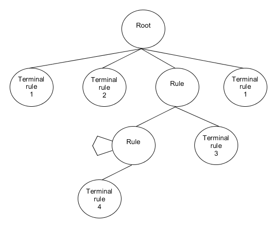
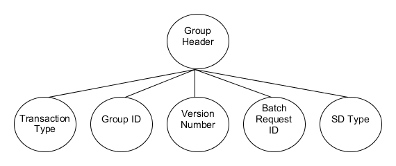

#####
Rules
#####

Depending on their scope, there are three kinds of rules:

- Terminal rules. These are fields, and are not composed by other rules.
- Record. These are the lines from the CWR files, and are composed of terminal rules.
- Group. These are aggregations of records. They may be composed of of any combination of rules, including other groups.

In practice only terminal rules are different. These are stored in Python
modules, and so are static, while the other rules are generated dynamically from
configuration files.

***************************
Rules aggregation and trees
***************************

Except for terminal rules, all rules are an aggregation of smaller rules,
creating a small tree.

These trees are read in pre-order.

Examples
========

Generic rules tree
------------------

The following example is a generic rules tree:

Rules nodes will be substituted by the rules they contain.

Note that the rule in the second level has a loop. This means that the rules
it contains may appear multiple times.

As trees are read in pre-order, this would read as:

"Rule composed of terminal rule 1, followed by terminal rule 2, followed by
terminal rule 4 multiple times, followed by terminal rule 3, followed by
terminal rule 1."

Group Header
------------

The following example represents the Group Header Record:

